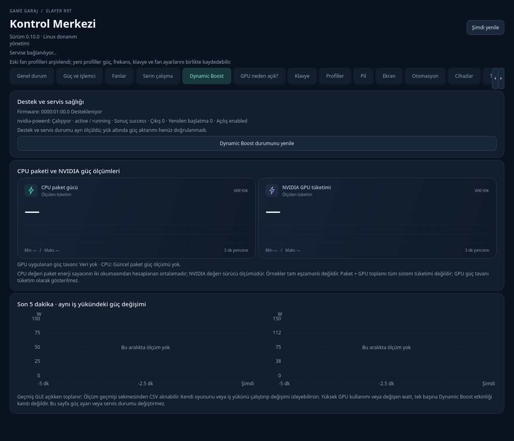

# Kontrol Merkezi Linux

**GameGaraj Slayer R9T için Linux / KDE Plasma donanım ve masaüstü kontrol merkezi.** Mevcut sürüm: **0.10.0**.

Güç, CPU boost, fanlar, RGB klavye, ekran ve cihaz ayarlarını tek arayüzde yönetir. Profiller ve isteğe bağlı otomasyonla ayarları birlikte uygular; sıcaklık, fan RPM ve güç ölçümleriyle sonuçları görünür kılar. Windows kontrol merkezinin bütün özelliklerini kapsadığı veya tüm oyun laptoplarında çalıştığı iddia edilmez.



## Hangi bilgisayar için?

| Bileşen | Geliştirilen / ölçüm yapılan yapılandırma |
| --- | --- |
| Laptop | **GameGaraj Slayer R9T**; DMI üretici `GAME GARAJ`, ürün `SLAYER R9T` |
| İşlemci | AMD Ryzen 9 8945HX |
| GPU | NVIDIA GeForce RTX 5070 Laptop GPU |
| BIOS / EC | BIOS `N.1.19GAR06`, EC proje kimliği `0x1a` |
| Masaüstü | KDE Plasma 6 / Wayland; KScreen, KWin ve KF6 oturum arayüzleri |
| Linux çalışma ölçümü | CachyOS, çekirdek `7.2.8-2-cachyos` |
| Araştırmada kayıtlı NVIDIA sürücüsü | `615.71.09` |
| Klavye | ITE8291, USB `048d:600b`, 6 × 21 statik RGB kanal haritası |

Bu tablo bir **doğrulama kaydıdır**, her sürüm için zorunlu minimum veya genel uyumluluk listesi değildir. Başka R9T BIOS'ları, farklı CPU/GPU seçenekleri, diğer dağıtımlar ve GNOME gibi masaüstleri ayrıca sınanmadı. Yalnız işlemcinin veya ekran kartının aynı olması fan/EC uyumluluğunu kanıtlamaz. Donanım servisi DMI modelini, fan köprüsü ayrıca EC kimliğini kontrol eder.

Başka model için R9T kurucusunu çalıştırmadan önce [yapay zekâ ile laptop uyarlama rehberini](outputs/docs/AI_LAPTOP_ADAPTATION_GUIDE.md) okuyun. Rehber yeni cihazda hangi kaynakların ve salt okunur arayüzlerin araştırılacağını anlatır; R9T'ye ait EC adresleri yeni modele doğrudan taşınmaz.

## Program neler yapıyor?

| Alan | Mevcut özellikler |
| --- | --- |
| Genel durum | CPU/GPU sıcaklık ve kullanım, frekans, fan RPM, NVIDIA tüketimi, RAM kullanımı ve pil durumu |
| Güç / CPU | Linux güç profili, AMD P-State boost, desteklenen CPU EPP enerji tercihleri ve CPU üst frekans sınırı |
| Soğutma | Sessiz/Ofis, Serin Dengeli ve Serin Oyun hazır ayarları; CPU/GPU frekans sınırlama |
| Fanlar | EC otomatik mod, maksimum soğutma, ayrı CPU/GPU %50–100 hedefleri, hazır ve dört noktalı kullanıcı eğrileri; soğumada histerezis ve kademeli düşüş |
| Sıcaklık hedefi | İsteğe bağlı yazılım kontrolü: CPU 60–85°C, GPU 60–80°C; fanları ve frekans tavanlarını sıcaklığa göre yönetir |
| RGB klavye | Tek renk/parlaklık; 126 kanallı statik gökkuşağı, üç bölge ve renk/parlaklık geçiş düzenleri; profil kaydı |
| Profiller | Güç, boost, frekans, EPP, RGB ve isteğe bağlı fan ayarlarını birlikte kaydetme/uygulama; kayıtlı profili ayrı taslakta düzenleme, kopyalama, silme ve JSON içe/dışa aktarma |
| Otomasyon | Açılış, priz/pil ve yürütülebilir dosya eşleşmesine göre profil; uygulama kuralını düzenleme ve ilk eşleşme önceliğini değiştirme; elle seçimde duraklatma; varsayılan kapalı |
| Ekran / oturum | Mevcut ekran modları ve Hz, parlaklık, KDE gece rengi, ICC dosyası; isteğe bağlı dahili ekran düşük Hz ve klavye ışığı zaman aşımı |
| Cihazlar / klavye | Wi-Fi, Bluetooth, uçak modu, touchpad, Fn Lock ve KDE Caps Lock / Control / Escape eşlemeleri; modele özel dahili FHD/IR kamera erişim kontrolü |
| Pil / SSD / RAM | Pil sağlık, döngü, voltaj, akım ve güç; mevcut NVMe ve `spd5118` sıcaklık sensörleri |
| Ölçüm geçmişi | GUI açıkken 5/30 dakika grafikler, min/ortalama/maks ve CSV dışa aktarımı; CPU paket gücü dahil |
| GPU tanılama | GPU neden açık? panelinde DRM ekran bağlantıları, runtime güç durumu ve görünür aygıt bağlantısı olan süreçler |
| Dynamic Boost | Firmware destek durumu, `nvidia-powerd` servis sağlığı ve ayrı CPU paket / NVIDIA güç ölçümleri |
| Kullanım / tanılama | Sistem tepsisi, hızlı profil/fan menüsü, işlem bildirimi ve JSON tanılama raporu |

Eksik sensörler `—` / veri yok olarak gösterilir. Arayüz seçilen ayarı ve sistemden geri okunan etkin değeri ayırır. Profillerin başarısız uygulanmasında önceki ayarlara dönüş denenir ve eksik geri dönüş bildirilir.

Profil düzenleyicisi yalnız işaretli alanları saklar; özel RGB haritası ve fan eğrisi korunabilir. İptal kayıtlı ayarları değiştirmez, kopyalama mevcut profilin üzerine yazmaz. Etkin otomasyonun kullandığı bir profil kaydedilirse yeni ayarlar sonraki uygun yenilemede otomatik uygulanabilir. Uygulama kuralları taslak olarak düzenlenir; sıra değişikliği ancak **Otomasyonu kaydet** ile kalıcı olur. Aynı yürütülebilir dosya yeniden eklenirse mevcut kural güncellenir ve önceliği korunur.

## Sınırlar ve henüz açılmayan özellikler

- **GPU watt/TGP yazımı, MUX, OEM Office/Gaming/Turbo modları, undervolt ve overclock açılmadı.** Komut adlarının veya register değerlerinin bulunması bu BIOS'ta çalışan bir kontrol kanıtı değildir.
- Standart pil şarj eşiği arayüzü varsa kontrol kullanılabilir; doğrulanan R9T'de bu arayüz bulunmadığından **%60/%80 şarj sınırı desteği doğrulanmadı**.
- Statik çok renkli RGB düzenleri mevcut; görsel hücre boyama düzenleyicisi ve donanım RGB animasyonları henüz tamamlanmadı.
- Sıcaklık hedefi yazılımla fan/frekans yönetir; kesin sıcaklık veya FPS garantisi vermez. GPU frekans komutunun kabulü, bağımsız limit geri okuması ile aynı değildir.
- Dynamic Boost destek bilgisi ve çalışan daemon, gerçek yük altında CPU → GPU güç aktarımını kanıtlamaz. CPU paket + NVIDIA tüketimi de toplam priz tüketimi değildir.
- GPU neden açık? paneli GPU'yu uyutmaz ve MUX değiştirmez. Açık aygıt bağlantısı tek başına gerçek GPU iş yükü kanıtı değildir.
- Fan zaman aşımı ve sıcaklık korumaları vardır; EC erişim hatası veya kernel kilitlenmesi altında başarılı geri dönüş garanti edilemez. Firmware korumalarının yerine geçmez.
- Fiziksel uyku/uyanma, prizden pile geçiş, uzun kullanım ve yük altında FPS/ısı karşılaştırması ayrı kabul işi olarak duruyor. Yeni otomasyon/kurulum geri dönüşleri kaynak testleriyle kontrol edildi; fiziksel cihazda yeniden kurulum ve kabul ayrıca gerekiyor.

Güncel kapsam ve kanıtlar: [IMPLEMENTATION_STATUS.md](outputs/docs/IMPLEMENTATION_STATUS.md). Öncelikli açık işler: [WORK_QUEUE.md](outputs/docs/WORK_QUEUE.md); yeni özellik adayları: [NEXT_FEATURES.md](outputs/docs/NEXT_FEATURES.md).

## Kurulum

Kurucu mevcut R9T kurulumuna göre hazırlanmıştır; **temiz bir yeni makinede uçtan uca kurulum henüz doğrulanmadı**. Hazır genel dağıtım paketi değildir. Özellikle uyarlanmış TUXEDO sürücüsü ön koşulunu kurucu kendiliğinden sağlamaz.

### Ön koşullar

- Python 3 ve **aynı sistem Python ortamında PySide6**. Betikler ve systemd birimleri `/usr/bin/python` kullanır; yalnız `python3` sunan bir dağıtımda yollar önce uyarlanmalıdır.
- `systemd`, çalışan masaüstü kullanıcı oturumu, `power-profiles-daemon` / `powerprofilesctl`; NVIDIA sürücüsü, `nvidia-smi` ve NVML desteği.
- C++17 derleyici, `pkg-config`, Qt6Gui geliştirme dosyaları, KF6 KIdleTime başlıkları ve kütüphanesi. Kurucu `/usr/include/KF6/KIdleTime` başlık yolunu kullanır.
- DKMS, çalışan çekirdeğin geliştirme başlıkları ve kernel modülü derleme araçları; yüklenebilir R9T modülü.
- **R9T için uyarlanmış TUXEDO/Uniwill/ITE8291 sürücüleri**. Önce [yerel sürücü yamaları](outputs/driver-patches/README.md) ve [fan köprüsü](outputs/docs/FANS.md) açıklamalarını okuyun. Yamalar `tuxedo-drivers` **4.24.0** kaynak sürümüne aittir; yeni sürüme körlemesine uygulanmaz.
- KDE Plasma 6 / Wayland araçları: `kscreen-doctor`, `busctl`, `kwriteconfig6`, `kreadconfig6`, `qdbus6`; Wi-Fi için NetworkManager / `nmcli`, Bluetooth için BlueZ. Eksik masaüstü desteği ilgili kontrolü sınırlar.

Paket adları ve geliştirme dosyalarının yerleri dağıtıma göre değişir; bu depo her dağıtım için sınanmış tek satırlık bağımlılık kurulum komutu sunmaz.

### Uygulamayı kurma

Doğru model ve ön koşullar hazırlandıktan sonra, depo kökünden masaüstü kullanıcınızla:

```sh
cd outputs
sudo /usr/bin/python install-r9t.py
systemctl status slayer-r9t.service
systemctl --user status slayer-r9t-session.service
```

Program menüde **Slayer R9T Kontrol Merkezi** adıyla açılır. Terminalden:

```sh
/usr/bin/python /usr/local/lib/slayer-r9t/r9t-control-center.py
```

Kurucu fan köprüsünü DKMS ile derler, root donanım servisini ve kullanıcı oturumu servisini kurar. Uygulama dosyaları `/usr/local/lib/slayer-r9t/` altındadır. Uygulama, root servis, masaüstü başlatıcısı ve kullanıcı servisinin son aktivasyon adımları aynı geri alma kapsamındadır: hata halinde önceki dosyalar ile servislerin aktif/açılış durumları geri getirilir; eksik geri alma bildirilir. **DKMS kaynakları/derlemesi ve yüklenmiş kernel modülü bu kapsamın dışındadır.** `linked` / `indirect` veya maskelenmiş servis düzenleri değişiklikten önce reddedilir. Önceki uygulama yedeği `/usr/local/lib/.slayer-r9t-previous` altında tutulur.

Günlükler ve servisi durdurma:

```sh
journalctl -u slayer-r9t.service
journalctl --user -u slayer-r9t-session.service
sudo systemctl disable --now slayer-r9t.service
systemctl --user disable --now slayer-r9t-session.service
```

Son iki komut servisleri durdurur/devre dışı bırakır; dosyaları veya DKMS modülünü kaldıran tam kaldırma işlemi değildir. GUI'yi kapatmak donanım servisini veya etkin sıcaklık hedefini durdurmaz; seçimi arayüzden durdurabilirsiniz.

## Mimari ve yerel veriler

- **PySide6 GUI** kullanıcı yetkisiyle çalışır; servis ve tanılama sorgularını alt süreçlerle yürütür.
- **Root donanım servisi** model denetimi ve sınırlı Unix soketi protokolüyle önceden tanımlı işlemleri kabul eder. İstemci genel shell komutu veya keyfi EC adresi gönderemez.
- **Kullanıcı oturumu servisi** KDE/Wayland ayarlarını, boşta kalma ve ekran otomasyonunu yürütür.
- **R9T fan köprüsü** sabit fan arayüzünü, kontrol yenileme zaman aşımını ve sıcaklık korumalarını kernel tarafında tutar.
- Ayarlar `~/.config/slayer-r9t-control-center/settings.json`, servis politikası `/var/lib/slayer-r9t/`, sınırlı boyutlu işlem günlükleri `actions.jsonl` altında tutulur. Ölçüm geçmişi GUI oturumundadır; CSV dışa aktarımı ayrıca yapılır.

Tanılama ve ekran görüntülerini paylaşırken kendi süreç adlarınızı, dosya yollarınızı ve cihaz bilgilerinizi gözden geçirin. Depodaki kabul kayıtları belirli bir test cihazına aittir; gizlilik için anonimleştirilmiş örnekler metadata ile belirtilir ve ham canlı kayıt sayılmaz.

Kaynak kod: [`outputs/slayer_r9t/`](outputs/slayer_r9t/), testler: [`outputs/tests/`](outputs/tests/), köprü: [`outputs/fan-driver/`](outputs/fan-driver/). Ayrıntılı [mimari](outputs/docs/ARCHITECTURE.md) ve [kullanım belgesi](outputs/README.md).

## Doğrulama ve geliştirme

3 Ekim 2026 tarihli son kaynak doğrulamasında **150 birim testi geçti**; kayıtlı profil/otomasyon düzenleme için 14 Qt offscreen ve 9 kural testi dahil. Fan köprüsünün gerçek C kodunu kullanan ayrı hata simülasyonu geçti. Önceki güvenilirlik diliminde kernel **7.2.8-2-cachyos** başlıklarıyla LLVM nesne derlemesi başarılı oldu; bu dilimde sürücü değiştirilmedi. Bu sonuçlar gerçek donanım yükü, modül yükleme, temiz kurulum veya farklı laptop desteği anlamına gelmez. Özel canlı kontrollerin kapsamı ve sonuçları [durum belgesinde](outputs/docs/IMPLEMENTATION_STATUS.md) ayrı tutulur.

Son güvenilirlik düzeltmeleri oyun sonrası GPU frekans sınırını geri alır, etkin profil düzenlemelerini yeniden uygular ve fanın otomatik kontrole dönüşü başarısız olduğunda yeniden denemeyi sürdürür. Uygulama/kullanıcı-servisi kurulumu son adımda hata verse de önceki dosyaları ve servis durumlarını geri alır; DKMS sürücü kurulumu bu geri alma kapsamının dışındadır. Yeni kaynak henüz fiziksel cihazda yeniden kurulup doğrulanmadı.

Python 3 + PySide6 ortamında, depo kökünden:

```sh
cd outputs
PYTHONPATH=. PYTHONDONTWRITEBYTECODE=1 QT_QPA_PLATFORM=offscreen python -m unittest discover -s tests -q
```

Donanıma erişmeyen ayrı fan hata simülasyonu, C derleyicisi bulunan ortamda depo kökünden `python outputs/fan-driver/test_fallback.py` ile çalıştırılır.

[Headless regression iş akışı](.github/workflows/regression.yml), `main` push'larında ve pull request'lerde Ubuntu 24.04 / Python 3.14.7 / PySide6 6.11.2 ile bu iki kontrolü çalıştırır. Qt testleri `offscreen` kullanır; fan C kodu bellekte simüle edilmiş EC hatalarıyla sınanır. İş akışı uygulamayı veya kernel modülünü kurmaz, canlı donanım testlerini çalıştırmaz. Kaynakta iş akışının bulunması GitHub koşusunun geçtiği anlamına gelmez; uzak koşu sonucu ayrıca kontrol edilir.

`tests/live_*.py` kontrolleri ayrıca çalıştırılır; bazıları gerçek fan, frekans, ekran, RGB veya kamera durumunu kısa süre değiştirir. Her betiğin model/izin koşullarını ve başlangıç durumuna dönüşünü okuyun; bu kontroller rutin birim testi komutunun parçası değildir.

Katkı önerilerinde model / BIOS / kernel / masaüstü bilgisi, tekrar üretme adımları ve mevcut değer / istenen değer ayrımını yazın. Seri numarası, kullanıcı adı, erişim anahtarı veya kişisel profil dosyası paylaşmanız gerekmez. Yeni laptop desteği için önce salt okunur keşif ve bağımsız model adaptörü geliştirin.

## Araştırırken nerelere baktık?

Linux arayüzlerini, üreticinin Windows kontrol merkezinin model tanımlarını ve mevcut sürücü kaynaklarını karşılaştırdık. OEM adlarını yalnız aday işlev saydık; Linux geri okuması ve gerçek cihaz ölçümü olmadan kontrol açmadık.

- [GameGaraj R9T resmi sürücü / kontrol merkezi sayfası](https://www.gamegaraj.com/suruculer/laptop/game-garaj-slayer-r9t-5070-amd-ryzen-9-8945hx-rtx5/?id=4324): ControlCenterX **5.62.60.32** paketindeki EC sabitleri, profil tanımları ve kamera komutları yerel olarak incelendi. Üretici paketleri burada yeniden dağıtılmaz.
- [TUXEDO sürücü kaynakları v4.24.0](https://github.com/tuxedocomputers/tuxedo-drivers/tree/v4.24.0): Uniwill erişimi, ITE8291 RGB kanalları, cihaz eşlemesi ve sürücü başlangıcı için karşılaştırma; yerel farklar [`driver-patches/`](outputs/driver-patches/) altında korunur.
- [Linux Uniwill sürücüsü](https://github.com/torvalds/linux/blob/master/drivers/platform/x86/uniwill/uniwill-acpi.c): fan sıcaklık / PWM / RPM adresleri ve byte sırası için karşılaştırma kaynağı.
- [KDE KScreen kaynakları](https://github.com/KDE/libkscreen/blob/master/src/doctor/doctor.cpp), kurulu KWin D-Bus arayüzleri ve KF6 KIdleTime başlıkları: ekran ve kullanıcı oturumu kontrolleri.
- Linux CPUFreq / AMD P-State, hwmon, power_supply, DRM ve PCI runtime güç arayüzleri; NVIDIA NVML ve `nvidia-powerd` belgeleri: standart kontrol, sensör ve güç tanılaması yolları. İlgili birincil kaynak bağlantıları [soğutma](outputs/docs/COOLING.md), [GPU tanılama](outputs/docs/GPU_DIAGNOSTICS.md) ve [Dynamic Boost](outputs/docs/DYNAMIC_BOOST.md) belgelerinde.

**Başka laptopu olanlar için:** [AI_LAPTOP_ADAPTATION_GUIDE.md](outputs/docs/AI_LAPTOP_ADAPTATION_GUIDE.md) dosyasını yapay zekâya vererek model keşfi, kaynak taraması, güvenli adaptör tasarımı ve doğrulama planı oluşturabilirsiniz. [Donanım araştırma notu](outputs/docs/HARDWARE_RESEARCH.md) bu yöntemin R9T'deki örneğidir; diğer modellerin desteğini kanıtlamaz.

Yerel OEM çıkarımları, indirilmiş araçlar, derleme çıktıları ve eski paketler `work/` / `outputs/releases/` altında Git dışında tutulur. TUXEDO kaynaklarının lisans bildirimi [`TUXEDO-LICENSE`](outputs/driver-patches/TUXEDO-LICENSE) dosyasındadır; bu bildirim tüm uygulama için otomatik bir lisans ataması değildir.
